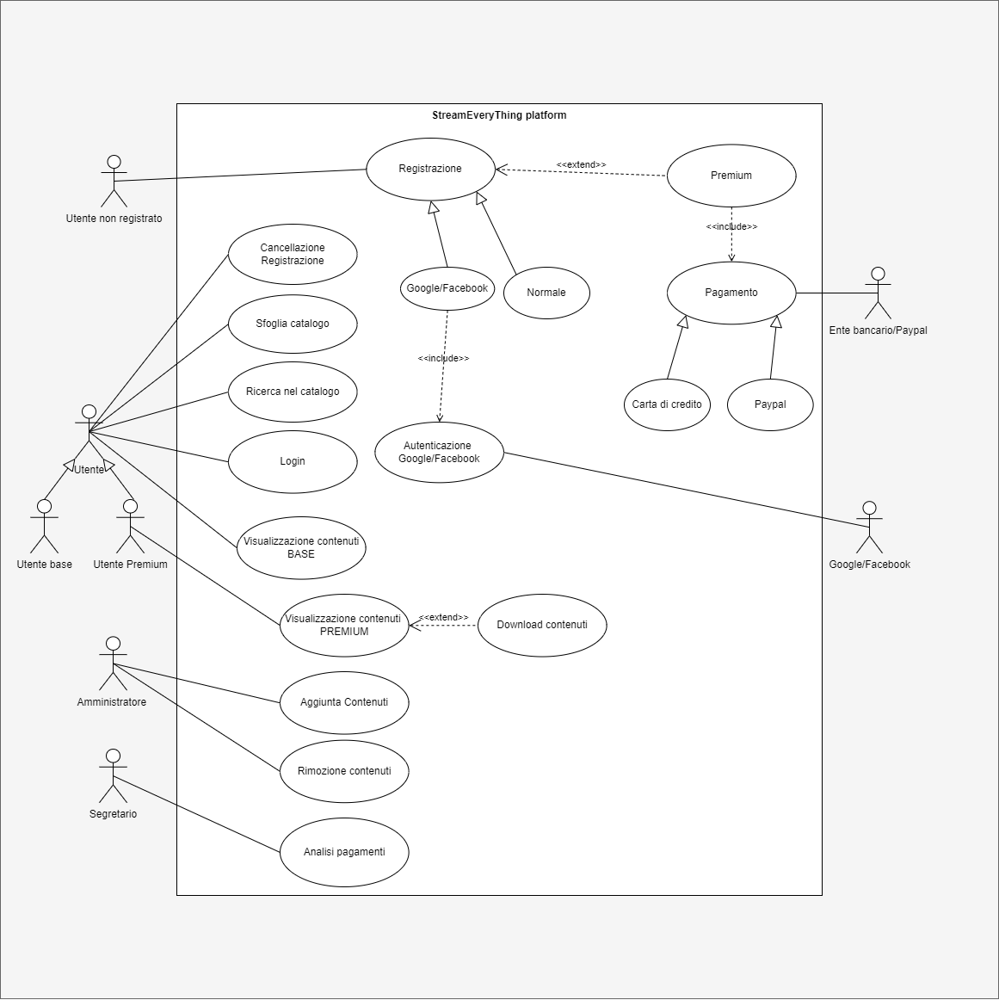
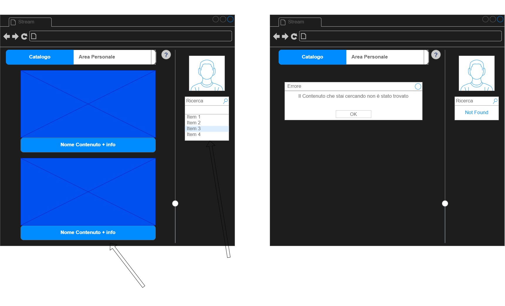

# Caso d'Uso: Visualizzazione Base 
## Breve Descrizione: un utente registrato guarda un film/serie  
## Attori primari: utente registrato
## Attori secondari: none
## Precondizioni: l'utente è connesso a internet ed è registrato
## Sequenza degli eventi principale: 
1. L'utente si autentica sulla piattaforma.
2. L'utente seleziona un contenuto base.
3. Il sistema avvia la riproduzione in streaming.
4. L'utente visualizza il contenuto.
## Postcondizioni: il contenuto viene visualizzato correttamente 
## Sequenza degli eventi alternativa:
1. Se la connessione internet dell'utente è instabile o troppo lenta, il sistema interrompe la riproduzione e mostra un messaggio di errore.
2. Se il contenuto non è disponibile per problemi tecnici, il sistema visualizza un messaggio di indisponibilità. 
3. Se l'utente non è registrato e  prova a visualizzare un contenuto, il sistema lo rimanda al form di registrazione.
4. se l'utente base cerca di visualizzare un contenuto per utenti premium, viene reindirizzato alla pagina di pagamento

# Caso d'Uso: Ricerca
## Breve Descrizione: un utente ricerca un contenuto fra quelli disponibili  
## Attori primari: Utenti
## Attori secondari: none
## Precondizioni: L'utente è connesso a internet
## Sequenza degli eventi principale: 
1. l'utente inserisce dati riconducibili al contenuto che vuole visualizzare (Iniziali del titolo/data di uscita/genere ecc)
2. il sistema mostra i contenuti che corrispondono alla ricerca
## Postcondizioni: il sistema trova i contenuti ricercati
## Sequenza degli eventi alternativa:
1. se il contenuto cercato dall'utente non è presente, il sistema glielo comunica
2. se l'utente inserisce dati invalidi, il sistema mostra un messaggio di errore
